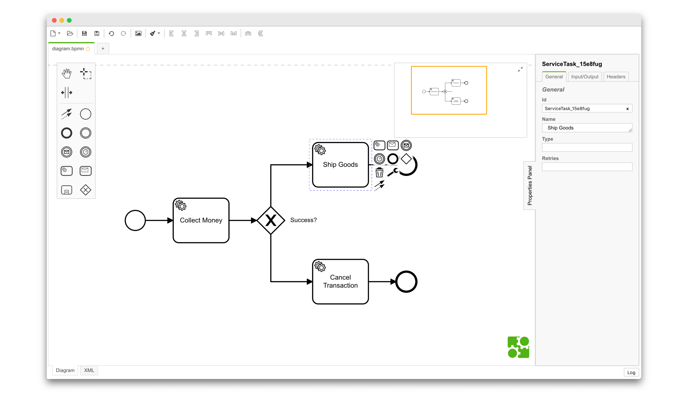

# Zeebe Modeler

[](https://travis-ci.com/zeebe-io/zeebe-modeler)

The visual workflow editor for [Zeebe](https://zeebe.io/) based on [bpmn.io](http://bpmn.io).




## Installation

#### All Platforms

[Download](https://github.com/zeebe-io/zeebe-modeler/releases), extract and execute app.

#### MacOSX

Requires [homebrew](https://brew.sh/index_de.html) and [cask](https://caskroom.github.io):

```sh
brew install --cask zeebe-modeler
```

#### Windows (using Scoop)

Requires [Scoop](https://github.com/lukesampson/scoop) and the [scoop-extras](https://github.com/lukesampson/scoop-extras) bucket:

```
scoop install zeebe-modeler
```

## Resources

* [Changelog](./CHANGELOG.md)
* [Download](https://github.com/zeebe-io/zeebe-modeler/releases) (see also [nightly builds](https://zeebe-modeler-nightly.s3.eu-central-1.amazonaws.com/))
* [Give Feedback](https://forum.zeebe.io/)
* [Report a Bug](https://github.com/zeebe-io/zeebe-modeler/issues/new/choose)


## Building the Application

```sh
# checkout a tag
git checkout v1.1.0

# install dependencies
npm install

# execute all checks (lint, test and build)
npm run all

# build the application to ./dist
npm run build
```


### Development Setup

Spin up the application for development, all strings attached:

```sh
npm run dev
```


## Code of Conduct

This project adheres to the Contributor Covenant [Code of
Conduct](/CODE_OF_CONDUCT.md). By participating, you are expected to uphold
this code. Please report unacceptable behavior to
code-of-conduct@zeebe.io.


## License

MIT

Contains parts ([bpmn-js](https://github.com/bpmn-io/bpmn-js)) released under the [bpmn.io license](http://bpmn.io/license).
