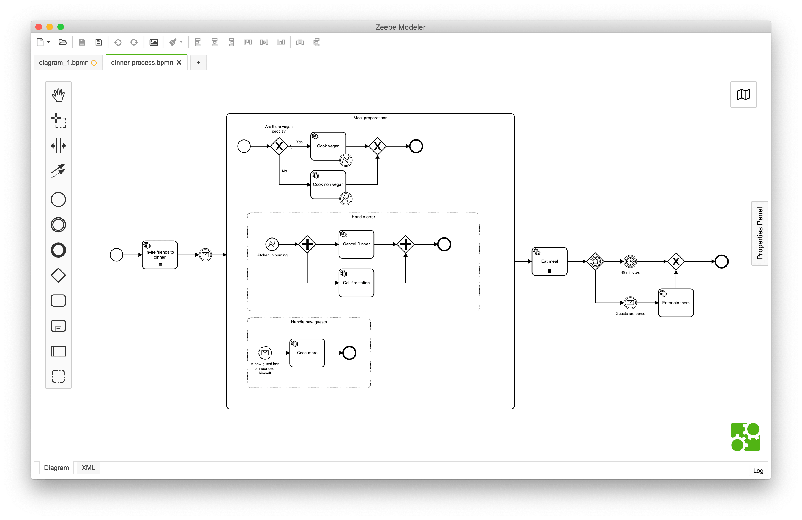

# Zeebe Modeler

[](https://travis-ci.com/zeebe-io/zeebe-modeler)

The visual workflow editor for [Zeebe](https://zeebe.io/) based on [bpmn.io](http://bpmn.io).




## Install:

npm install

MacOSX users: `brew cask install zeebe-modeler` (requires [homebrew](https://brew.sh/index_de.html) and [cask](https://caskroom.github.io))

## Dev-Mode
npm run dev

## Distro
npm run distro
run this command for creating install files


Tests are currently not working.

Refectoring is coming soon....

## Fork synchronization

In order to keep changes inside the original [camunda-modeler](https://github.com/camunda/camunda-modeler) synced with the Zeebe Modeler fork, a proper synchronization of the fork is needed. For this, the [sync-fork task](./tasks/sync-fork.js) exists inside this project.

For executing the synchronization task, simple use

```sh
$ npm run sync
```

If no merge conflicts appeared, the synchronization task is done and the changes can be pushed remotely. If there were merge conflicts detected, the task automatically exclude unrelated files from the conflicts (e.g. changes inside `tabs/bpmn/*`). After this, another merge conflicts have to be solved manually.

## Code of Conduct

This project adheres to the Contributor Covenant [Code of
Conduct](/CODE_OF_CONDUCT.md). By participating, you are expected to uphold
this code. Please report unacceptable behavior to
code-of-conduct@zeebe.io.

## License

MIT

Contains parts ([bpmn-js](https://github.com/bpmn-io/bpmn-js)) released under the [bpmn.io license](http://bpmn.io/license).
